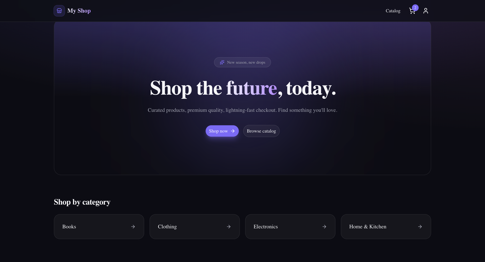
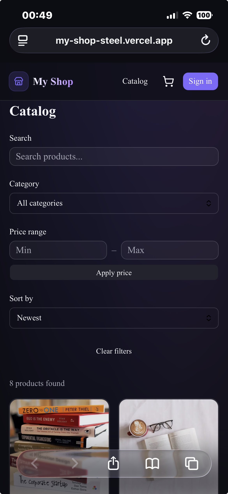
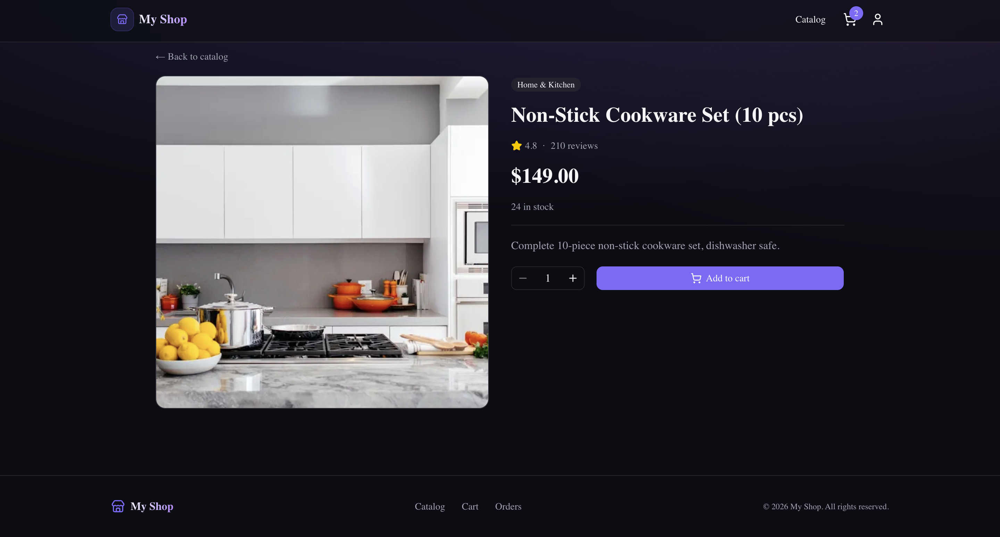
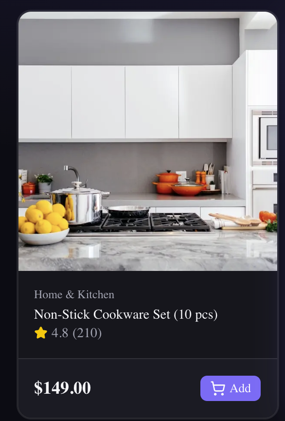
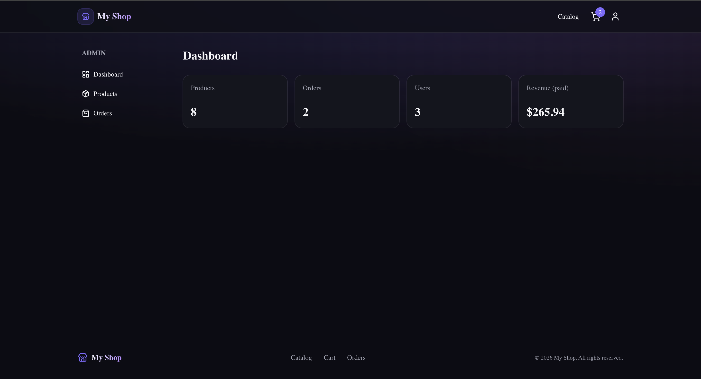
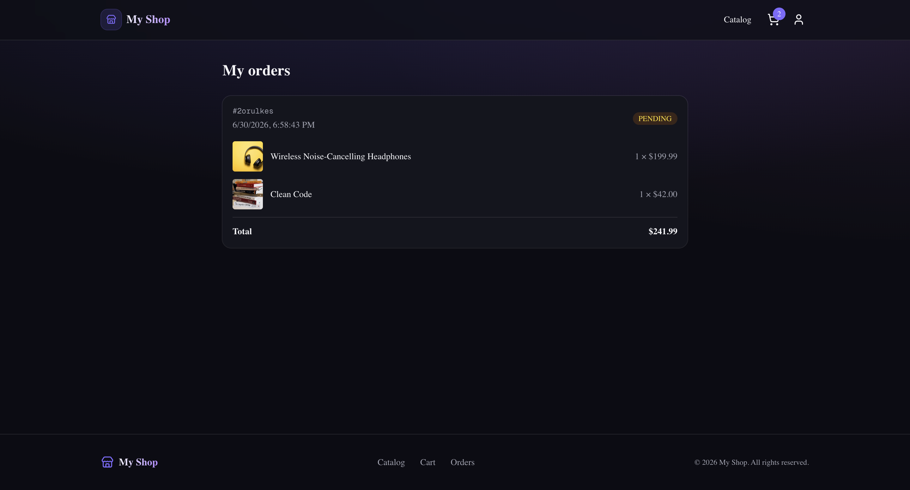

<div align="center">

# 🛍️ My Shop

### A full-stack, production-ready e-commerce platform built with the modern web stack.

[](https://my-shop-steel.vercel.app)

[](https://nextjs.org/)
[](https://www.typescriptlang.org/)
[](https://tailwindcss.com/)
[](https://www.prisma.io/)
[](https://www.postgresql.org/)
[](https://stripe.com/)
[](https://next-auth.js.org/)

</div>

---

## ✨ Overview

**My Shop** is a complete e-commerce experience — from browsing a filterable product
catalog to a secure Stripe checkout with webhook-verified orders and a role-based admin
dashboard. It's built on **Next.js 16 (App Router)** with **Server Components**, fully
typed with **TypeScript**, and styled with a **premium dark UI**.

> 🔗 **Live demo:** **[my-shop-steel.vercel.app](https://my-shop-steel.vercel.app)**

### 🔑 Demo accounts

| Role  | Email             | Password    |
| ----- | ----------------- | ----------- |
| Admin | `admin@shop.com`  | `admin1234` |
| User  | `user@shop.com`   | `user1234`  |

> 💳 **Test card** for checkout: `4242 4242 4242 4242` · any future date · any CVC.

---

## 📸 Screenshots

> _Add your screenshots to `docs/screenshots/` and they'll appear here._

| Home | Catalog | Product |
| --- | --- | --- |
|  |  |  |

| Cart | Admin dashboard | Orders |
| --- | --- | --- |
|  |  |  |

---

## 🚀 Features

### 🛒 Storefront
- **Home page** with hero, categories and featured products
- **Catalog** with live search, category filter, price range and sorting
- **Product pages** with multi-image gallery and quantity selector
- **Cart** powered by Zustand, persisted to `localStorage`

### 🔐 Authentication
- Email / password auth + **Google OAuth** (NextAuth.js)
- JWT sessions with **role-based access** (`USER` / `ADMIN`)
- Protected routes via middleware (`/account`, `/admin`)

### 💳 Payments
- **Stripe Checkout** — sessions created server-side with authoritative pricing
- **Webhook** (`checkout.session.completed`) verifies payment, marks orders `PAID`
  and decrements stock (idempotent)
- Success / cancel flows

### 🛠️ Admin dashboard
- Stats overview (products, orders, users, revenue)
- Create / delete products (multi-image support)
- View all orders and update their status

---

## 🧱 Tech Stack

| Layer        | Technology                                                |
| ------------ | --------------------------------------------------------- |
| Framework    | Next.js 16 (App Router, Server Components, Server Actions) |
| Language     | TypeScript                                                |
| Styling      | Tailwind CSS v4 + shadcn/ui + Lucide icons                |
| Database     | PostgreSQL (Supabase) + Prisma 7 (driver adapters)        |
| Auth         | NextAuth.js (Credentials + Google)                        |
| Payments     | Stripe Checkout + Webhooks                                |
| State        | Zustand (persisted cart)                                  |
| Deployment   | Vercel                                                    |

---

## 📁 Project Structure

```
src/
├── app/
│   ├── (auth)/login, register      # auth pages
│   ├── account/                    # profile + order history (protected)
│   ├── admin/                      # admin dashboard (ADMIN only)
│   ├── api/                        # auth, register, checkout, stripe webhook
│   ├── cart/                       # cart page
│   ├── checkout/                   # success / cancel
│   ├── products/                   # catalog + product detail
│   └── page.tsx                    # home
├── components/                     # UI, products, layout, admin
├── lib/                            # prisma, auth, stripe, products, orders
├── store/                          # Zustand cart store
├── types/                          # shared types
└── middleware.ts                   # route protection
prisma/
├── schema.prisma                   # data model
└── seed.ts                         # demo data
```

---

## ⚙️ Getting Started

### Prerequisites
- Node.js 18+
- A PostgreSQL database (e.g. [Supabase](https://supabase.com))
- A [Stripe](https://stripe.com) account (test mode)

### 1. Clone & install

```bash
git clone https://github.com/yegizbayevv77/my-shop.git
cd my-shop
npm install
```

### 2. Environment variables

Copy `.env.example` to `.env` and fill in your values:

```bash
cp .env.example .env
```

```env
DATABASE_URL=            # Supabase pooled connection (port 6543)
DIRECT_URL=              # Supabase direct connection (port 5432)
NEXTAUTH_SECRET=         # openssl rand -base64 32
NEXTAUTH_URL=http://localhost:3000
GOOGLE_CLIENT_ID=        # optional
GOOGLE_CLIENT_SECRET=    # optional
STRIPE_SECRET_KEY=sk_test_...
NEXT_PUBLIC_STRIPE_PUBLISHABLE_KEY=pk_test_...
STRIPE_WEBHOOK_SECRET=whsec_...
NEXT_PUBLIC_APP_URL=http://localhost:3000
```

### 3. Database

```bash
npx prisma migrate dev --name init   # create tables
npx prisma generate                  # generate client
npx prisma db seed                   # seed demo data
```

### 4. Run

```bash
npm run dev
```

Open [http://localhost:3000](http://localhost:3000) 🎉

### 5. Test Stripe webhooks locally

```bash
stripe listen --forward-to localhost:3000/api/webhooks/stripe
```

---

## ☁️ Deployment

Deployed on **Vercel** with a **Supabase** PostgreSQL database. See
[`DEPLOY.md`](./DEPLOY.md) for the full step-by-step guide (env vars, production Stripe
webhook, Google OAuth redirect URIs).

---

## 💡 Implementation Highlights

- **Server-first data fetching** — catalog and product pages are React Server
  Components querying Prisma directly, with `Decimal` prices safely serialized to the client.
- **Secure checkout** — the API never trusts client-side prices; it re-reads products
  from the database and validates stock before creating a Stripe session.
- **Idempotent webhooks** — order fulfillment is wrapped in a transaction and guarded
  against duplicate events.
- **Prisma 7 driver adapters** — runtime uses `@prisma/adapter-pg` with the pooled
  connection; migrations use the direct connection.

---

## 📄 License

Released under the [MIT License](./LICENSE).

<div align="center">

Built with ☕ and Next.js by [**@yegizbayevv77**](https://github.com/yegizbayevv77)

</div>
